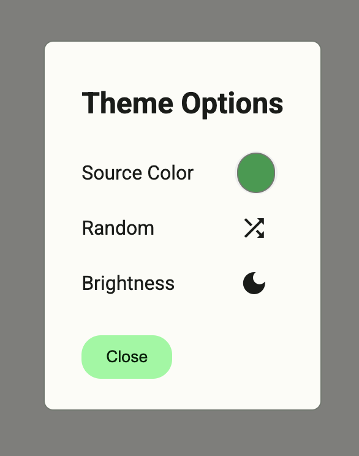

# Material Theme Control

Drop in component to style a Material 3 web app.

[Demo](https://rodydavis.github.io/material-theme-control/)

## Usage

```html
<material-theme-control></material-theme-control>
<script type="module" src="https://rodydavis.github.io/material-theme-control/material-theme-control.es.js"></script>
```


